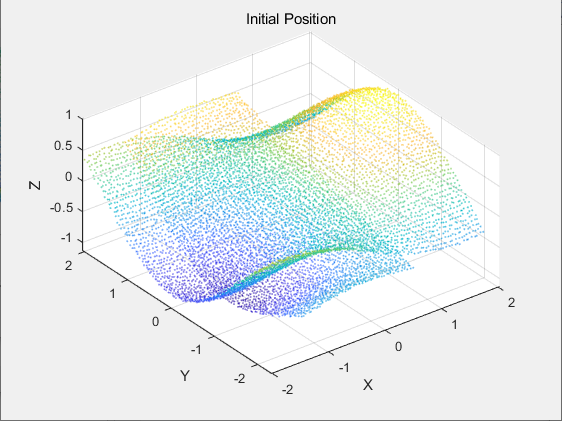
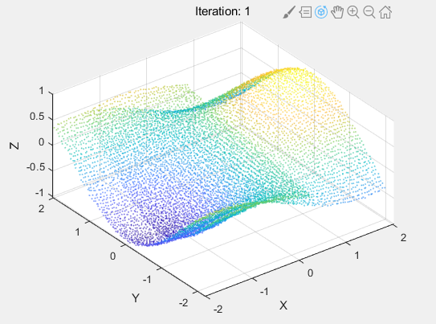
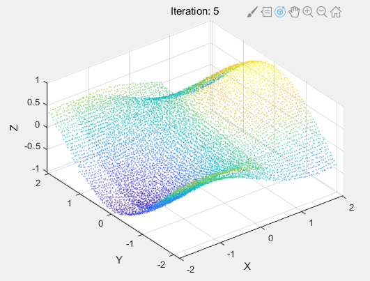
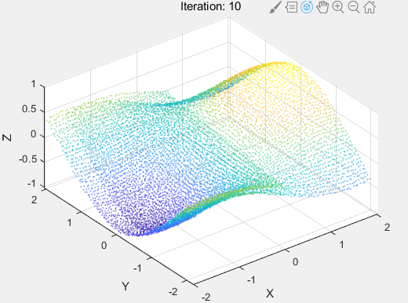
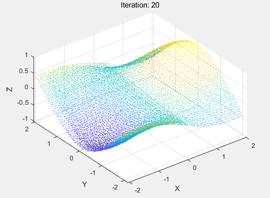
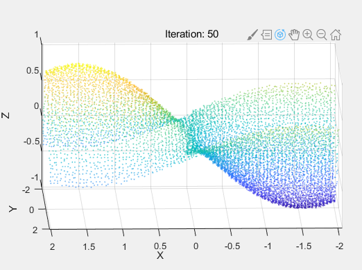

# ICP-MATLAB-Code
Iterative closet point algorithm (Point to point distance)
Theory derivation can be seen in cs685-icp.pdf P8

How to use:
1. open demo.m, and run it.
2. you can replace P_ori and X_ori with any other datasets.
   Remember, P->X_ori, so rotation matrix and translation vector are imposed to P.

Result:

